# Overview
In this project, we used digital PCR to measure the expression of M cell marker genes (GP2, SpiB, CCL20), interferon-stimulated genes (ISG15, MX1, IFI6, etc), and TLRs. 

We initially iterated through several previously published organoid media formulations to determine which resulted in the highest M cell marker expression. These experiments were performed in duodenal-derived organoids from a single donor.

# M cell marker expression
## Base media comparison
The first set of experiments, evaluating "differentiation" media published by Ding et al and "patterning" and "maturation" media published by He et al were repeated 3 times.

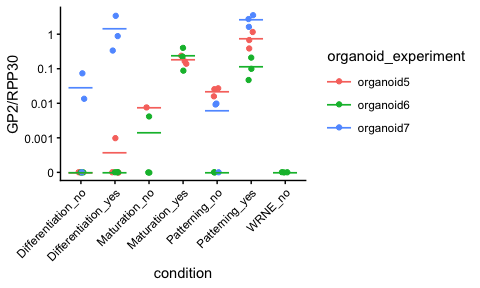<!-- -->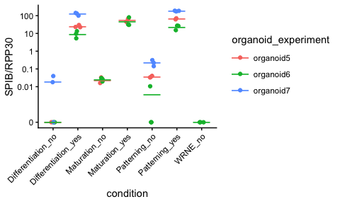<!-- -->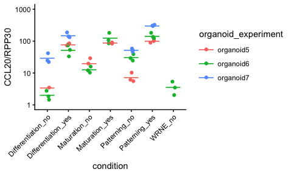<!-- -->

Alternatively, data can be plotted with media formulation on the x axis and colored based on the inclusion of M cell factors. Here, the data points represent the mean of technical replicates from three independent experiments.  
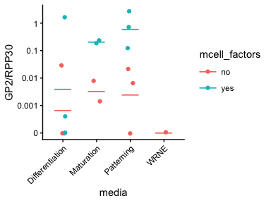<!-- -->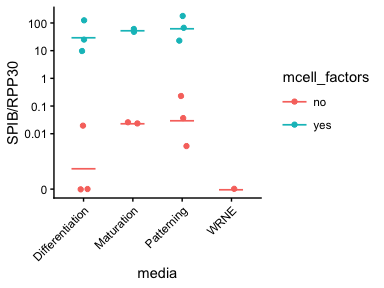<!-- -->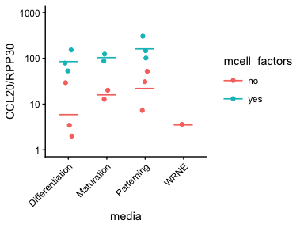<!-- -->

We prioritized patterning media in future experiments because it gave the most consistent increases in GP2 and SPIB expression.

## Lymphotoxin wash
### Experiments 8 and 9

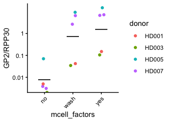<!-- -->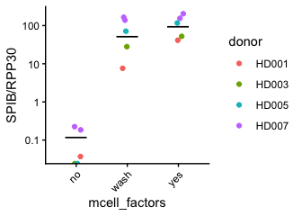<!-- -->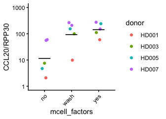<!-- -->

M cell markers are expressed following differentiation with LTa2b1 in 4 different donors, and the M cell marker expression is maintained even when the differentiation media is replaced with differentiation media without LTa2b1 for the last 48 hours. This is important for the M cell project because LTa2b1 strongly reactivates HIV in J-Lat and U1 cell lines.  

## Alternatives to LTa2b1
### Experiments 10 and 11

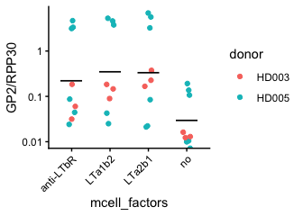<!-- -->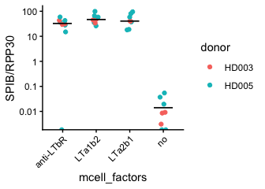<!-- -->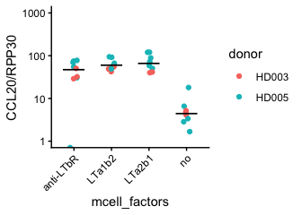<!-- -->

Alternative lymphotoxin beta receptor agonists result in similar M cell marker expression compared to LTa2b1, which could act through the TNF receptor or the lymphotoxin beta receptor. LTa1b2 was prioritized in following experiments because it gave similar M cell marker expression as LTa2b1, but did not reactivate HIV in J-Lat or U1.  

## Organoid stimulation
### Experiments 12 and 13
